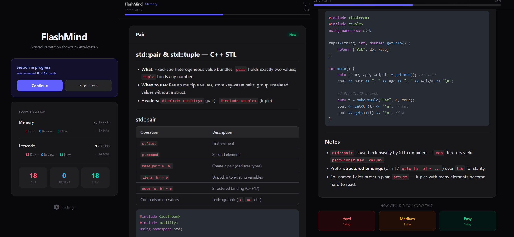

<div style="text-align:center">
  
  <h1>FlashMind</h1>
  <p style="max-width:800px;margin:0 auto;color:#555">A minimal spaced-repetition flashcard app powered by Markdown files.</p>
  
</div>

<br>

<div style="text-align:justify">
  FlashMind is an app for studying with spaced-repetition flashcards generated from your Markdown files. Point the app at one or more directories containing Markdown notes and those files will be used as card inputs for study sessions.
</div>

## Features

- Set one or more directories of Markdown files as card inputs
- Spaced-repetition study sessions
- Simple, clean UI with Markdown rendering

## Getting Started

Prerequisites: Node.js (recommended v18+)

Clone, install, and run:

```bash
git clone <repository-url>
cd flashmind
npm install
```

Run in development:

```bash
npm run dev
```

Build for production and start:

```bash
npm run build
npm run start
```

_\*100% vibecoded_
